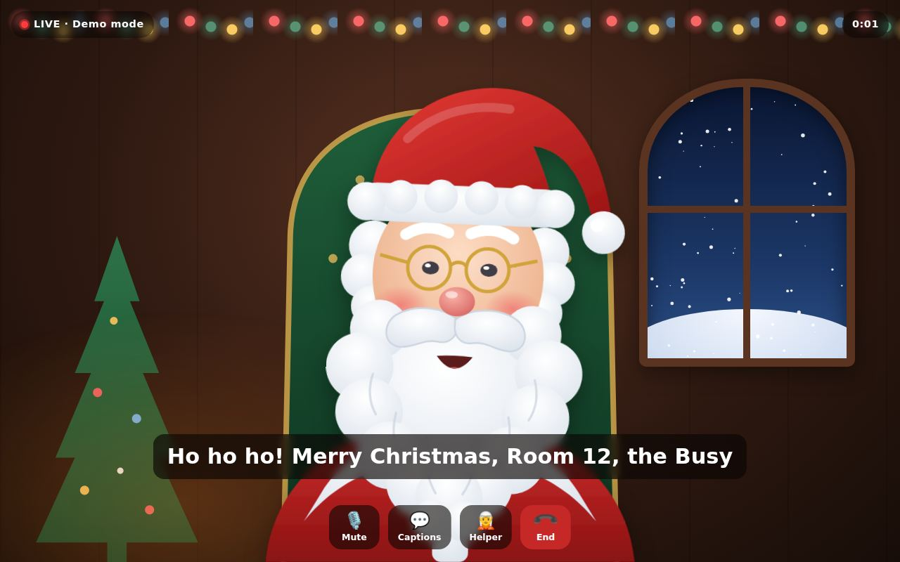
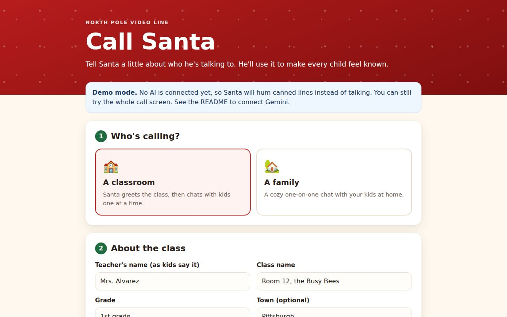
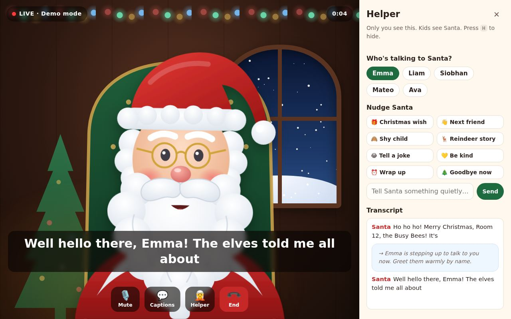
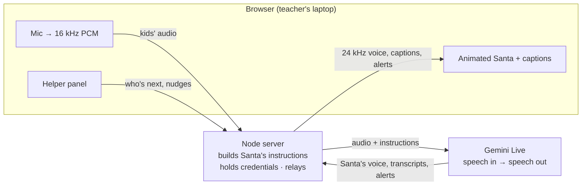
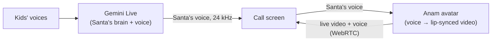

# Call Santa 🎅

Live, real-time video calls with an AI Santa, for classrooms and families.

A teacher or parent fills in a short setup: the class or family, what they've been up to, and each child's first name with a fact or two. Santa then talks with the kids live. He greets them by name, brings up what "the elves told him," asks what they're hoping for, and never promises a present. A helper panel that only the adult sees lets them tell Santa who's up next, nudge him ("tell a joke", "time to wrap up"), and get a quiet alert if a child says something worrying.



| Setup (stays on your device) | Helper panel (only the grown-up sees it) |
| --- | --- |
|  |  |

## Try it in 1 minute (demo mode, no keys)

```bash
cd santa-call
npm install
npm start
# open http://localhost:8787
```

With no AI configured, the app runs in **demo mode**. Santa hums canned lines instead of talking, but everything else is real: the setup page, the animated Santa with lip-sync, captions, the helper panel, hold-to-talk, and hang-up. Click **Fill in an example** on the setup page to see it with a sample class.

## Connect the real AI Santa

Santa's brain and voice come from **Gemini Live** (`gemini-3.8-live`, released Sept 15, 2026). It's a speech-to-speech model: kids' audio goes in and Santa's voice comes straight back out, with no separate speech-to-text or text-to-speech step. That's why replies feel quick and conversational.

### ⚠️ Pick the right Google backend

| Backend | Allowed with kids? | Use it for |
| --- | --- | --- |
| **Vertex AI** (Google Cloud) | Google Cloud's terms don't have the under-18 ban, but *you* must follow child-privacy law (see below). | **Real calls with kids** |
| **Gemini Developer API** (AI Studio key) | **No.** Its [terms](https://ai.google.dev/gemini-api/terms) forbid apps "directed towards or likely to be accessed by individuals under the age of 18." | Trying it out yourself, as an adult |

### Vertex AI (recommended)

1. Create or pick a Google Cloud project and enable the **Vertex AI API**.
2. Sign in so the server can use your credentials:
   ```bash
   gcloud auth application-default login
   ```
   When hosting, use a service account with the *Vertex AI User* role instead.
3. Create `santa-call/.env`:
   ```bash
   GOOGLE_CLOUD_PROJECT=your-project-id
   GOOGLE_CLOUD_LOCATION=us-central1
   ```
4. `npm start`. The console shows `Backend: vertex · model: gemini-3.8-live`.

If Google renames the model, set `SANTA_MODEL` to the Live model ID shown in your Cloud console.

### Gemini API key (adult testing only)

```bash
GEMINI_API_KEY=your-key   # in .env
```

The setup page shows a warning banner while this backend is active.

## How it works



- **The setup never leaves the browser until the call starts.** It's saved in `localStorage`. Use **Download setup** to carry it to another computer.
- **The server keeps credentials and Santa's instructions** (`shared/santa-prompt.js`) out of the browser. It saves nothing to disk.
- **Turn-taking.** In hands-free mode, Gemini's voice detection decides when a child is done. It's tuned to wait a bit longer, since kids pause mid-sentence. In a classroom, the mic is muted while Santa talks, so he doesn't hear himself through the speakers. Hold-to-talk hands the decision to the adult: hold the space bar while a child speaks.
- **Stage directions.** The helper panel sends notes like *"Emma is stepping up to talk to you now."* Santa acts on them but never reads them aloud. This is how he knows which child is in front of the camera.
- **Worried-child alerts.** Santa has a `notify_grown_up` tool. If a child mentions being hurt, grief, hunger, bullying, and so on, he answers gently and the adult gets a private alert. The alert shows as a red dot on the Helper button, so nothing appears on a projected screen.
- **Long calls.** Context-window compression and session resumption keep a call going past Gemini's per-connection limits. When Google asks the connection to move (`goAway`), the server reconnects on its own.

## Classroom tips

- Put the laptop close to where each child stands, and use an external speaker. For a loud room, pick **Hold to talk** in setup.
- The helper panel is on the same screen as Santa. When projecting, extend your display (don't mirror it) and keep the call on the projector. You can also press **H** to hide the panel and bring it back when needed. Keys: **H** helper, **M** mute, **C** captions, **Space** hold-to-talk.
- Tap a child's name as they step up. Santa greets them and uses one of their facts.
- Do a 2-minute test call before the kids arrive.

## Safety, privacy, and the rules

- **Kids' voices and your notes go to Google during the call.** Vertex AI doesn't train on your data. Use first names and friendly facts only. The setup page says this too.
- **Photoreal Santa** sends only Santa's generated voice to Anam, never the kids'. Anam's zero-data-retention option is Enterprise-only.
- **COPPA.** Collecting voice from kids under 13 is regulated in the US. A school running this should treat it like any other ed-tech tool: check district policy and get parent permission where required. The app stores nothing, which helps, but it does send audio to Google.
- **"Are you real?"** The adult picks the answer in setup: *keep the magic* ("North Pole magic!", and Santa never claims to be a human) or *be gently honest* ("a computer Santa grown-ups set up"). Some states now require AI disclosure to minors, so check what applies to you.
- **Hard rules in Santa's instructions:** never promise a present, never threaten the naughty list or tie presents to behavior, never ask for last names, addresses, or schools, stay G-rated, and be inclusive of families that have less or don't celebrate Christmas. Read exactly what Santa is told under **Show exactly what Santa will be told** on the setup page.
- **Hosting publicly?** Set `SANTA_ACCESS_CODE` so strangers who find the URL can't use your credits. Calls are also capped by `MAX_SESSIONS` and `MAX_CALL_MINUTES`.

## Cost

At Google's published Gemini 3.8 Live rates ($0.005/min audio in, $0.018/min audio out), a 10-minute call where Santa talks about half the time costs roughly **$0.15**. Vertex AI pricing can differ slightly, so check your console. Demo mode is free.

## Photoreal Santa

Out of the box, Santa is an illustrated, animated character. He blinks, breathes, nods while kids talk, glances up while "thinking," laughs at his own "ho ho ho," and his mouth follows his voice. He's free and adds no delay.

For a lifelike Santa, the app can hand his voice to **[Anam](https://anam.ai)**, a real-time avatar service. Gemini stays Santa's brain and voice. Anam turns his voice into lip-synced video of a real-looking Santa and streams it back to the browser.



Anam only ever receives **Santa's** voice. The kids' voices go to Gemini, never to Anam.

### Set it up

1. **Make a free Anam account** at [lab.anam.ai](https://lab.anam.ai) and create an API key. The free tier has 30 minutes and one custom avatar, which is enough to try it.
2. **Get a Santa portrait.** It should be square, at least 1152×1152, with the face in focus looking at the camera and hands out of view.
   - **A real Santa performer:** photograph them in costume. Get a signed release that allows their likeness to be used for an AI avatar.
   - **An AI-generated Santa:** make one with any image generator ("photorealistic portrait of Santa Claus, kind twinkling eyes, rosy cheeks, full white beard, red velvet suit, cozy workshop with warm lights behind him, looking at the camera, square"). Make sure it doesn't resemble a real, recognizable person.
3. **Turn the photo into an avatar:**
   ```bash
   # put ANAM_API_KEY=... in santa-call/.env first
   node scripts/create-santa-avatar.mjs ./santa.jpg
   ```
   It uploads the photo, waits for Anam to build the avatar (a couple of minutes), and prints the `ANAM_AVATAR_ID` to add to `.env`. You can also do this in Anam Lab.
4. **Restart the server.** The console shows `Santa: photoreal (Anam avatar …)`, and the call screen shows Santa in a framed window in the workshop.

Photoreal Santa works in demo mode too (he lip-syncs the demo hum), so you can see him before connecting Gemini.

### How it behaves

- **Fallback.** If Anam can't connect, or drops mid-call, the illustrated Santa takes over his voice right away and the helper panel says so. The call keeps going.
- **Interruptions.** When a child cuts in or you tap the next child's name, the avatar stops mid-word just like the voice does.
- **Expression.** Santa's baseline performance is set to warm and jolly (`lib/anam.js`). He gets a "laughter" cue on "ho ho ho" and a "supportive" cue when a worried-child alert fires.
- **Delay.** Anam buffers about 0.8 s of audio before it starts drawing, so photoreal Santa starts each reply a little later than the illustrated one. Kids are forgiving, but try it with your group.
- **Echo.** Santa's voice now plays from the video, and the classroom mic gating follows that audio, so he still won't hear himself.

### Cost

Anam charges per streaming minute, for the whole call: about **$0.16/min** on Starter ($12/mo), $0.14 on Explorer, $0.12 on Growth, and around $0.04 on Enterprise. With Gemini, a 10-minute photoreal call runs roughly **$1.50–$1.75**, versus about $0.15 for the illustrated Santa. Calls are capped by `MAX_CALL_MINUTES`, and Anam sessions are capped to match.

### Other options

- **[Simli](https://www.simli.com)** works the same way (voice in, video out). It's cheaper (about $0.05/min, less for its newer "Trinity" avatars) with lower claimed delay (under 300 ms), but it needs 16 kHz audio. To add it, write another player with the same methods as `public/js/anam-santa.js` (`enqueue`, `clear`, `endTurn`, `playing`).
- **[Tavus](https://www.tavus.io)** and **HeyGen LiveAvatar** are all-in-one video agents with their own brain and voice, so Gemini would be replaced rather than kept. Tavus "replicas" come from a 2-minute video of a consenting person and look extremely real.
- **Gemini Live Avatar** (Vertex AI) renders video inside the Gemini session itself. A *custom* face like Santa's is allow-list only for now.

## Deploying

The server is a single Node process with one dependency for WebSockets. Any host that supports WebSockets works. For **Google Cloud Run**:

- Set `HOST=0.0.0.0` and the Vertex AI variables, and run as a service account with *Vertex AI User*.
- Raise the request timeout to 3600 s so calls aren't cut off.
- Browsers only allow microphones on **HTTPS** (or `localhost`). Cloud Run gives you HTTPS automatically.

## Configuration

See [`.env.example`](.env.example). Everything is optional. With nothing set you get demo mode.

## Project layout

```
server.js                 HTTP + WebSocket server, backend selection, limits
lib/gemini-session.js     one live call ↔ Gemini Live (config, relay, tools, resume)
lib/mock-session.js       demo-mode Santa (no AI)
shared/santa-prompt.js    Santa's instructions (used by the server and the setup preview)
public/index.html         setup page          public/js/setup.js
public/call.html          call screen         public/js/call.js
public/js/santa-avatar.js animated SVG Santa with lip-sync
public/js/anam-santa.js   photoreal Santa (streams his voice into an Anam avatar)
lib/anam.js               mints Anam avatar sessions server-side
scripts/create-santa-avatar.mjs  photo → Anam avatar ID
public/js/audio.js        mic capture + gapless playback
public/js/mic-worklet.js  mic → 16 kHz PCM
test/                     npm test
```

## Status and next steps

This is a working prototype. The whole app runs end to end in demo mode, and 23 automated tests pass (`npm test`). The Gemini Live and Anam connections were built against each SDK's published types and checked against stand-ins, but **neither has been run against the real services yet**, because no credentials were available where it was built. The first real call is the thing to check. If Santa ignores helper nudges, set `SANTA_TEXT_INPUT=realtime`.

Ideas for next steps:

- A **phone remote** for the helper panel, so the teacher controls the call from their phone while the laptop shows only Santa.
- Hear-before-you-pick **voice previews** in setup.
- **Multiple languages.** Gemini already switches automatically; the UI would need translating.
